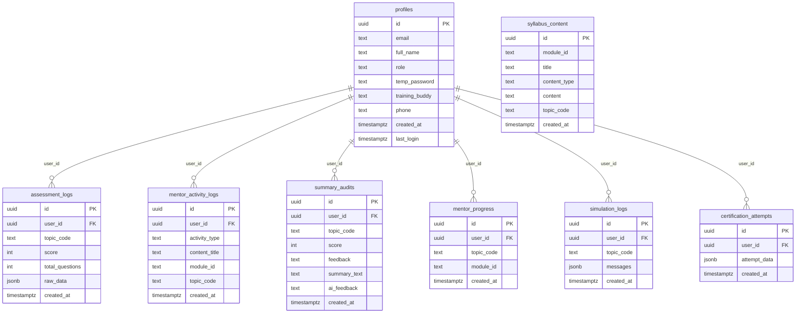

# LMS Platform — Supabase Database Schema

> **Quick Reference** for admins to find user credentials, activity logs, and all stored data.

---

## Table Relationship Diagram



---

## Table Details

### 1. `profiles` — User Accounts & Credentials

| Column | Type | Description |
|---|---|---|
| `id` | `uuid` (PK) | Matches Supabase Auth user ID |
| `email` | `text` | Login email address |
| `full_name` | `text` | Display name |
| `role` | `text` | `counsellor` or `admin` |
| **`temp_password`** | **`text`** | **Initial login password set by admin during provisioning** |
| `training_buddy` | `text` | JSON array of assigned buddies: `[{name, email, phone}]` |
| `phone` | `text` | Contact number |
| `created_at` | `timestamptz` | Account creation timestamp |
| `last_login` | `timestamptz` | Last authenticated session |

> [!IMPORTANT]
> **`temp_password`** stores the plaintext password set during account provisioning. This is the credential counsellors use for their first login. It is visible in the Admin Registry under each user's row.

---

### 2. `assessment_logs` — Quiz & Viva Results

| Column | Type | Description |
|---|---|---|
| `id` | `uuid` (PK) | Unique record ID |
| `user_id` | `uuid` (FK → profiles) | The counsellor who took the quiz |
| `topic_code` | `text` | e.g. `M1-01`, `M2-03` |
| `score` | `int` | Number of correct answers |
| `total_questions` | `int` | Total questions in the quiz |
| `raw_data` | `jsonb` | Full Q&A: `{questions: [{question, options, correct_answer}], answers: [...]}` |
| `created_at` | `timestamptz` | When the assessment was completed |

---

### 3. `mentor_activity_logs` — Activity Trail

| Column | Type | Description |
|---|---|---|
| `id` | `uuid` (PK) | Unique record ID |
| `user_id` | `uuid` (FK → profiles) | Who performed the action |
| `activity_type` | `text` | `signup`, `module_view`, `topic_complete`, `quiz_pass`, etc. |
| `content_title` | `text` | Human-readable description of what was done |
| `module_id` | `text` | e.g. `module-1`, `module-2`, `System` |
| `topic_code` | `text` | Specific topic within the module |
| `created_at` | `timestamptz` | When the activity occurred |

---

### 4. `summary_audits` — Peer Audit & Feedback Reports

| Column | Type | Description |
|---|---|---|
| `id` | `uuid` (PK) | Unique record ID |
| `user_id` | `uuid` (FK → profiles) | The counsellor being audited |
| `topic_code` | `text` | Audit category (e.g. `FINAL-REVIEW`) |
| `score` | `int` | Performance score (0–100) |
| `feedback` | `text` | Admin-written feedback/observations |
| `summary_text` | `text` | Counsellor-submitted summary or audit data |
| `ai_feedback` | `text` | AI-generated analysis of the submission |
| `created_at` | `timestamptz` | Submission timestamp |

---

### 5. `syllabus_content` — Dynamic Content (Admin-Managed)

| Column | Type | Description |
|---|---|---|
| `id` | `uuid` (PK) | Unique record ID |
| `module_id` | `text` | Parent module (e.g. `module-1`) |
| `topic_code` | `text` | Unique topic identifier |
| `title` | `text` | Display title |
| `content_type` | `text` | `video`, `document`, `link` |
| `content` | `text` | URL or text content |
| `created_at` | `timestamptz` | When the content was added |

---

### 6. `mentor_progress` — Topic Completion Tracking

| Column | Type | Description |
|---|---|---|
| `id` | `uuid` (PK) | Unique record ID |
| `user_id` | `uuid` (FK → profiles) | The counsellor |
| `topic_code` | `text` | Which topic was completed (e.g. `M1-01`) |
| `module_id` | `text` | Parent module |
| `created_at` | `timestamptz` | When the topic was marked complete |

---

### 7. `simulation_logs` — Mock Call / Practice Sessions

| Column | Type | Description |
|---|---|---|
| `id` | `uuid` (PK) | Unique record ID |
| `user_id` | `uuid` (FK → profiles) | The counsellor |
| `topic_code` | `text` | Which topic's simulation |
| `messages` | `jsonb` | Full conversation log with AI |
| `created_at` | `timestamptz` | Session timestamp |

---

### 8. `certification_attempts` — Final Certification Exams

| Column | Type | Description |
|---|---|---|
| `id` | `uuid` (PK) | Unique record ID |
| `user_id` | `uuid` (FK → profiles) | The counsellor |
| `attempt_data` | `jsonb` | Full exam data and results |
| `created_at` | `timestamptz` | When the attempt was made |

---

## Admin Quick-Reference Queries

### Find a User's Password
```sql
SELECT full_name, email, temp_password
FROM profiles
WHERE email = 'user@example.com';
```

### List All User Credentials
```sql
SELECT full_name, email, temp_password, role, created_at
FROM profiles
ORDER BY created_at DESC;
```

### View a User's Full Activity History
```sql
SELECT activity_type, content_title, module_id, topic_code, created_at
FROM mentor_activity_logs
WHERE user_id = '<USER_UUID>'
ORDER BY created_at DESC;
```

### Check Quiz Scores for a User
```sql
SELECT topic_code, score, total_questions,
       ROUND((score::float / total_questions) * 100) AS percentage,
       created_at
FROM assessment_logs
WHERE user_id = '<USER_UUID>'
ORDER BY created_at DESC;
```

### See All Completed Topics for a User
```sql
SELECT topic_code, module_id, created_at
FROM mentor_progress
WHERE user_id = '<USER_UUID>'
ORDER BY created_at ASC;
```

### View Audit Reports for a User
```sql
SELECT topic_code, score, feedback, ai_feedback, created_at
FROM summary_audits
WHERE user_id = '<USER_UUID>'
ORDER BY created_at DESC;
```

### Find Users Who Haven't Logged In
```sql
SELECT full_name, email, created_at, last_login
FROM profiles
WHERE last_login IS NULL AND role = 'counsellor'
ORDER BY created_at DESC;
```
